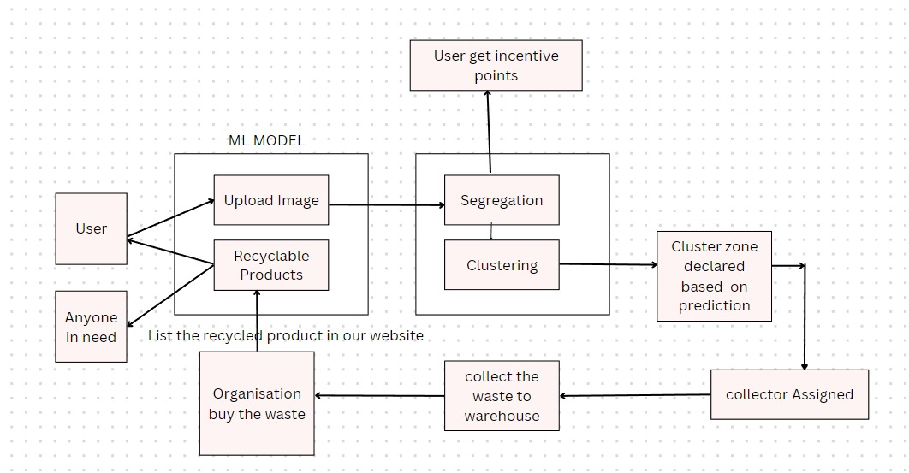

<h1>EcoBin</h1>
</img>
<h1>A Novel and Sustainable way of Managing Waste powered by AI Models  
<h1>What problem do we solve ?</h1>
<ul>
<li>Garbage Collection is mostly done by Muncipality and the methods used for managing and collecting waste are highly ineffective which doesn't ensure proper waste management</li>
<li>Waste are of three types : Recyclable,Non Recyclable,Organic waste which needs to be segregated for recycling process but the muncipality collects the waste with recylable and non-recyclable waste pilled together which makes it costly to segeragate the waste</li>
<li>A better way of waste management would be done in the most effective way if at the top level people already keep their waste segerated into different bins which requires concious effort from the people which is difficult to achieve</li>
</ul>
<h1>How do we solve it ?</h1>
<ul>
    <li>To solve the problem at the upper level i.e. to make people segeregate their waste we need to provide them some incentives in the form of reward points to them to achieve regular segeration of waste by the people they can use these reward points to purchase premium quality recycled products listed on our website
    </li>
    <li>Since we will also provide collection services of these waste, we need to collect the waste with minimal cost thus to achieve it, we built a clustering ML model which would help us generate clusters with a centroid longitude and latitude where we would install our bins and from where our collector will pick up the garbage
    <li>
    We also provide platform for the organisations who will purchase the raw materials from us and then will list their recycled products made by them on our website.
    </li>
</ul>
<h1>
    Our Product
</h1>
</img>
<h1>Work Flow</h1>
</img>
<h1><strong> Development Installation </strong></h1>

Follow these instructions to set up your development environment, which you need to do before you start contributing code to this project.

<h1><strong> Manual Installation </strong></h1>

_Note_: The installation steps assume you are using a Unix-like shell. If you are using Windows, you will need to use `copy` instead of `cp`.

1. Install Node.js. The recommended way is to Node through [nvm](https://github.com/nvm-sh/nvm). You can also install [node.js](https://nodejs.org/download/release/v16.14.2/) version 16.14.2 directly from the Node.js website.
2. [Clone](https://github.com/WittyhacksCR004/WH037_HackTheHustle/) your new fork of the repository from GitHub onto your local computer.

   ```
   $ git clone https://github.com/aayanlobo/EcoBin
   ```
3. Navigate to frontend directory and implement the following commands :

   ```
   $ cd frontend
   $ npm install
   $ npm start
   ```
4. Now get out of the frontend directory using the following command
  ```
  $ cd ..
  ```
5. Navigate to the backend directory and implement the following commands
  ```
   $ cd backend
   $ npm install
   $ npm start
   ```

# Links

- [GitHub Repository](https://github.com/aayanlobo/EcoBin))
- [Deployed Project](https://eco-bin.vercel.app/)


# Showcase
|          |               |
| :--------------------------------------------------: | :-----------------------------------------------------: |
|  |  |
